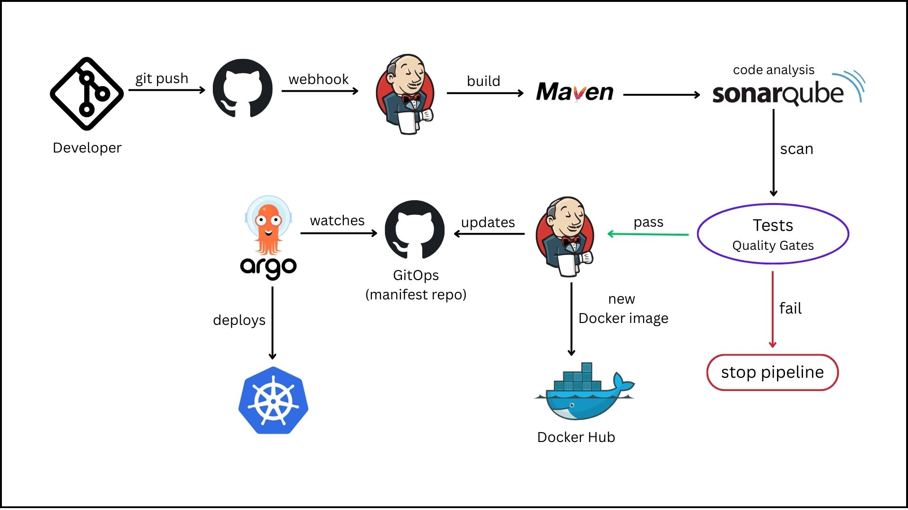
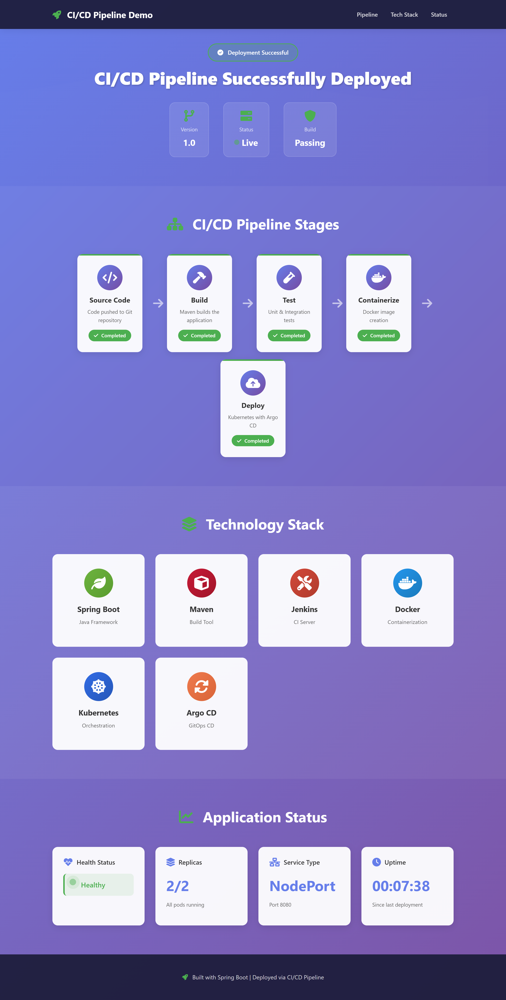

# Complete CI/CD Pipeline for Spring Boot Application

A comprehensive CI/CD implementation demonstrating automated build, test, code quality analysis, containerization, and GitOps-based deployment of a Spring Boot web application.

---

## Table of Contents

### Getting Started

- [Quick Start](#quick-start)
- [Overview](#overview)
- [Prerequisites](#prerequisites)

### Architecture & Design

- [Architecture Overview](#architecture-overview)
- [Technology Stack](#technology-stack)
- [Project Structure](#project-structure)

### Setup & Configuration

- [CI/CD Pipeline Stages](#cicd-pipeline-stages)
- [Jenkins Setup](#jenkins-setup)
- [Docker Configuration](#docker-configuration)
- [Kubernetes Deployment](#kubernetes-deployment)

### Installation & Deployment

- [Installation and Setup](#installation-and-setup)
- [Local Development](#local-development-setup)
- [Full CI/CD Pipeline Setup](#full-cicd-pipeline-setup)

### Operations

- [Monitoring and Maintenance](#monitoring-and-maintenance)
- [Deployed Application](#deployed-application)
- [Security Considerations](#security-considerations)

---

## Quick Start

Get up and running in 5 minutes:

### Prerequisites

- Java 11+, Maven 3.x, Docker, and Git installed

### Steps

1. **Clone and Build**:

   ```bash
   git clone https://github.com/DinethShakya23/CI-CD-pipeline-spring-boot.git
   cd CI-CD-pipeline-spring-boot
   mvn clean package
   ```

2. **Run Locally**:

   ```bash
   mvn spring-boot:run
   # Access: http://localhost:8080
   ```

3. **Build Docker Image**:

   ```bash
   docker build -t spring-boot-app:local .
   docker run -p 8080:8080 spring-boot-app:local
   ```

4. **Deploy to Kubernetes**:
   ```bash
   kubectl apply -f deployment.yml
   kubectl get pods -l app=spring-boot-app
   ```

For detailed setup instructions, see [Installation and Setup](#installation-and-setup).

---

## Overview

This project demonstrates a complete CI/CD pipeline for a Spring Boot web application using industry-standard DevOps tools and practices. The pipeline automatically builds, tests, analyzes code quality, containerizes the application, and deploys it to a Kubernetes cluster using GitOps principles.

<!-- ### Key Features

- **Automated Testing** - Unit tests run on every commit
- **Code Quality Analysis** - SonarQube integration for code quality metrics
- **Containerization** - Automated Docker image creation and registry push
- **Kubernetes Deployment** - Container orchestration with 2 replicas
- **GitOps** - Automated deployment updates via ArgoCD
- **Version Tracking** - Automatic image versioning using build numbers
- **Security** - Credential management via Jenkins vault -->

---

## Prerequisites

### Required Software

- **Java 11** or higher
- **Maven 3.x**
- **Docker** (for local containerization)
- **Git** (for version control)
- **Kubernetes cluster** (Minikube, EKS, AKS, GKE, etc.)
- **Jenkins server** (with Docker support)
- **SonarQube server** (for code analysis)

### Required Accounts & Access

- **GitHub** account with Personal Access Token (repo write permissions)
- **Docker Hub** account for image registry
- **Cloud provider account** (if using managed Kubernetes)

### Network Requirements

- Jenkins ↔ SonarQube connectivity
- Jenkins ↔ Docker Hub connectivity
- Jenkins ↔ GitHub connectivity
- Kubernetes ↔ Docker Hub connectivity

---

## Architecture Overview

### System Architecture



The architecture diagram illustrates the complete pipeline flow from code commit through production deployment.

---

## Technology Stack

### Application Layer

| Component           | Technology  | Version       |
| ------------------- | ----------- | ------------- |
| **Language**        | Java        | 11            |
| **Framework**       | Spring Boot | 2.2.4 RELEASE |
| **Template Engine** | Thymeleaf   | Latest        |
| **Build Tool**      | Maven       | 3.x           |

### DevOps & CI/CD Tools

| Component           | Tool               | Purpose                                     |
| ------------------- | ------------------ | ------------------------------------------- |
| **CI/CD Platform**  | Jenkins            | Pipeline orchestration                      |
| **Build Agent**     | Maven Docker Agent | `dinethshakya/maven-docker-agent:java17-v1` |
| **Code Quality**    | SonarQube          | Code analysis & metrics                     |
| **Version Control** | Git/GitHub         | Repository management                       |

### Containerization & Orchestration

| Component             | Technology                        | Purpose                      |
| --------------------- | --------------------------------- | ---------------------------- |
| **Container Runtime** | Docker                            | Application containerization |
| **Base Image**        | adoptopenjdk/openjdk11:alpine-jre | Lightweight JRE environment  |
| **Orchestration**     | Kubernetes                        | Container orchestration      |
| **GitOps Tool**       | ArgoCD                            | Automated deployments        |
| **Registry**          | Docker Hub                        | Image repository             |

---

## Project Structure

```
CI-CD-pipeline-spring-boot/
├── src/                                      # Application source code
│   └── main/
│       ├── java/
│       │   └── com/application/
│       │       ├── StartApplication.java              # Spring Boot entry point
│       │       └── controller/
│       │           └── ApplicationStatusController.java  # REST endpoints
│       └── resources/
│           ├── static/                      # Static assets
│           │   ├── css/main.css
│           │   └── js/main.js
│           └── templates/
│               └── index.html
│
├── maven-docker-agent/                      # Custom Jenkins agent
│   └── dockerfile
│
├── CI/CD Configuration
│   ├── Jenkinsfile                          # Pipeline definition (171 lines)
│   ├── Dockerfile                           # Application containerization
│   └── deployment.yml                       # Kubernetes manifest
│
├── Build Configuration
│   └── pom.xml                              # Maven project config
│
└── Documentation
    ├── README.md                            # This file
    └── images/                              # Visual assets
        ├── architecture.jpg
        └── webapp.png
```

**Key Directories**:

- `src/` - Application source code
- `maven-docker-agent/` - Custom Jenkins agent Dockerfile
- Jenkinsfile, Dockerfile, deployment.yml - Pipeline configuration files

---

## CI/CD Pipeline Stages

The Jenkins pipeline consists of **5 automated stages** with clear progression from code to production:

### 1. Checkout

**Purpose**: Retrieve the latest source code from GitHub

```groovy
stage('Checkout') {
  steps {
    checkout scm
  }
}
```

**Actions**:

- Clones the repository from GitHub
- Uses credentials configured in Jenkins
- Triggers automatically on code push or PR merge

---

### 2. Build and Test

**Purpose**: Compile application and run unit tests

```bash
mvn clean package
```

**Actions**:

- Removes previous build artifacts (`mvn clean`)
- Compiles Java source code
- Executes JUnit tests
- Creates executable JAR: `target/spring-boot-web.jar`

**Success Criteria**: All tests pass, JAR created successfully

---

### 3. Static Code Analysis

**Purpose**: Analyze code quality, security, and coverage

```bash
mvn sonar:sonar \
  -Dsonar.login=$SONAR_AUTH_TOKEN \
  -Dsonar.host.url=${SONAR_URL}
```

**Metrics Analyzed**:

- Bugs and code smells
- Security vulnerabilities
- Code coverage
- Code complexity
- Code duplication

**Required Credential**: `Token_For_SonarQube`

---

### 4. Build and Push Docker Image

**Purpose**: Containerize the application and push to Docker Hub

```bash
docker build -t dinethshakya/spring-boot-app:${BUILD_NUMBER} .
docker push dinethshakya/spring-boot-app:${BUILD_NUMBER}
```

**Image Versioning**:

- Format: `dinethshakya/spring-boot-app:<BUILD_NUMBER>`
- Example: `dinethshakya/spring-boot-app:42`
- Each build creates a uniquely versioned image

**Required Credential**: `dockerhub-credentials`

---

### 5. Update Deployment File (GitOps)

**Purpose**: Automatically update Kubernetes deployment configuration

**Process**:

1. Clone GitHub repository
2. Update `deployment.yml` with new image version
3. Commit with message: `"Update deployment image to version ${BUILD_NUMBER}"`
4. Push to GitHub main branch
5. ArgoCD detects change and triggers deployment

**Git Operations**:

```bash
sed -i "s|dinethshakya/spring-boot-app:[0-9]*|dinethshakya/spring-boot-app:${BUILD_NUMBER}|g" deployment.yml
git add deployment.yml
git commit -m "Update deployment image to version ${BUILD_NUMBER}"
git push origin main
```

**Required Credential**: `github-ci-cd` (GitHub Personal Access Token)

---

## Jenkins Setup

## Jenkins Setup

### Custom Jenkins Docker Agent

The pipeline uses a pre-configured Docker agent with essential build tools:

**Image**: `dinethshakya/maven-docker-agent:java17-v1`

**Included Tools**:

- Maven 3.x (Java build automation)
- Java 17 runtime
- Docker CLI (for image operations)
- Git (for repository operations)

**Agent Configuration** (from Jenkinsfile):

```groovy
agent {
  docker {
    image 'dinethshakya/maven-docker-agent:java17-v1'
    args '--user root -v /var/run/docker.sock:/var/run/docker.sock'
  }
}
```

> [!NOTE]
> The Docker socket mount enables Docker-in-Docker functionality for building and pushing images from within the Jenkins container.

---

### Required Jenkins Credentials

Configure these in **Jenkins → Manage Jenkins → Credentials → System → Global credentials**:

| Credential ID           | Type              | Used By                 | Description                     |
| ----------------------- | ----------------- | ----------------------- | ------------------------------- |
| `Token_For_SonarQube`   | Secret text       | Stage 3 (Code Analysis) | SonarQube authentication token  |
| `dockerhub-credentials` | Username/Password | Stage 4 (Docker Push)   | Docker Hub registry credentials |
| `github-ci-cd`          | Secret text       | Stage 5 (GitOps Update) | GitHub Personal Access Token    |

---

### Environment Variables

The pipeline defines these in the Jenkinsfile:

```groovy
environment {
  DOCKER_REGISTRY = 'https://index.docker.io/v1/'
  SONAR_URL = 'http://13.235.41.162:9000'
  GIT_USER_NAME = 'DinethShakya23'
  GIT_USER_EMAIL = 'dinethshakya19@gmail.com'
  GIT_REPO_NAME = 'CI-CD-pipeline-spring-boot'
  DOCKER_IMAGE = "dinethshakya/spring-boot-app:${BUILD_NUMBER}"
}
```

> [!IMPORTANT]
> Update `SONAR_URL`, `GIT_USER_NAME`, `GIT_USER_EMAIL`, and `GIT_REPO_NAME` to match your setup before running the pipeline.

---

### Creating the Jenkins Pipeline

#### 1. Create New Pipeline Job

- Navigate to Jenkins dashboard
- Click **"New Item"**
- Enter job name (e.g., `spring-boot-cicd`)
- Select **"Pipeline"** → Click **OK**

#### 2. Configure Pipeline Source

Under **"Pipeline"** section:

- **Definition**: Select `"Pipeline script from SCM"`
- **SCM**: Select `"Git"`
- **Repository URL**: `https://github.com/DinethShakya23/CI-CD-pipeline-spring-boot.git`
- **Credentials**: Select your GitHub credentials
- **Branch**: `*/main`
- **Script Path**: `Jenkinsfile`

#### 3. Configure Build Triggers (Optional)

- Enable **"GitHub hook trigger for GITScm polling"** for automatic builds on push

#### 4. Save and Build

- Click **"Save"**
- Click **"Build Now"** to run the pipeline

---

## Docker Configuration

### Dockerfile Explanation

The Dockerfile creates a lightweight container image for the Spring Boot application:

```dockerfile
# Base image: Alpine Linux with Java 11 JRE (lightweight)
FROM adoptopenjdk/openjdk11:alpine-jre

# JAR artifact location from Maven build
ARG artifact=target/spring-boot-web.jar

# Application working directory
WORKDIR /opt/app

# Copy JAR into container
COPY ${artifact} app.jar

# Run Spring Boot application
ENTRYPOINT ["java","-jar","app.jar"]
```

**Image Characteristics**:

- **Base Image**: `adoptopenjdk/openjdk11:alpine-jre` (lightweight Alpine Linux)
- **Image Size**: ~120 MB (Alpine reduces size significantly vs Ubuntu)
- **Exposed Port**: 8080 (Spring Boot default)
- **Entry Point**: Runs the packaged JAR file

---

### Building Locally

**Build the Application**:

```bash
mvn clean package
```

**Build Docker Image**:

```bash
docker build -t spring-boot-app:local .
```

**Run Container Locally**:

```bash
docker run -p 8080:8080 spring-boot-app:local
```

**Test Application**:

```bash
curl http://localhost:8080
```

---

## Kubernetes Deployment

### Deployment Architecture

The [deployment.yml](./deployment.yml) defines both the Kubernetes Deployment and Service for high availability and external access.

### Deployment Specification

```yaml
apiVersion: apps/v1
kind: Deployment
metadata:
  name: spring-boot-app
spec:
  replicas: 2 # Run 2 pod replicas for HA
  selector:
    matchLabels:
      app: spring-boot-app
  template:
    spec:
      containers:
        - name: spring-boot-app
          image: dinethshakya/spring-boot-app:1 # Updated by pipeline
          ports:
            - containerPort: 8080
```

### Service Specification

```yaml
apiVersion: v1
kind: Service
metadata:
  name: spring-boot-service
spec:
  type: NodePort # Makes service externally accessible
  selector:
    app: spring-boot-app
  ports:
    - protocol: TCP
      port: 8080
      targetPort: 8080
```

---

### Deploying to Kubernetes

**Apply Deployment**:

```bash
kubectl apply -f deployment.yml
```

**Check Deployment Status**:

```bash
kubectl get deployments
kubectl get pods -l app=spring-boot-app
kubectl get service spring-boot-service
```

**Access Application** (minikube):

```bash
minikube service spring-boot-service
```

**View Pod Logs**:

```bash
kubectl logs -f <pod-name>
```

---

### Scaling

**Scale to Multiple Replicas**:

```bash
kubectl scale deployment spring-boot-app --replicas=5
```

**Verify Scaling**:

```bash
kubectl get pods -l app=spring-boot-app
```

---

## Installation and Setup

### Local Development Setup

#### 1. Clone Repository

```bash
git clone https://github.com/DinethShakya23/CI-CD-pipeline-spring-boot.git
cd CI-CD-pipeline-spring-boot
```

#### 2. Build Application

```bash
mvn clean package
```

**Output**: `target/spring-boot-web.jar`

#### 3. Run Application

**Option A - Using Maven**:

```bash
mvn spring-boot:run
```

**Option B - Using JAR**:

```bash
java -jar target/spring-boot-web.jar
```

#### 4. Verify Application

Access in browser: **`http://localhost:8080`**

The application displays:

- Live deployment status
- CI/CD pipeline stages
- Technology stack info
- Real-time health monitoring
- Application uptime tracker

#### 5. Test REST API Endpoints

```bash
# Check status
curl http://localhost:8080/api/status

# Check health
curl http://localhost:8080/api/health

# Get application info
curl http://localhost:8080/api/info
```

#### 6. Configure Custom Port (Optional)

Edit `src/main/resources/application.properties`:

```properties
server.port=8081
```

---

## Full CI/CD Pipeline Setup

Complete setup guide for the entire pipeline infrastructure.

### Step 1: SonarQube Setup

**Run SonarQube with Docker**:

```bash
docker run -d --name sonarqube -p 9000:9000 sonarqube:latest
```

**Access SonarQube**:

- URL: `http://localhost:9000`
- Default credentials: `admin` / `admin`

**Generate Authentication Token**:

1. Navigate to **Administration → Security → Users**
2. Click your user profile
3. Click **"Generate Tokens"**
4. Copy and save the token for Jenkins configuration

---

### Step 2: Jenkins Setup

**Install Jenkins with Docker**:

```bash
docker run -d -p 8080:8080 -p 50000:50000 \
  -v jenkins_home:/var/jenkins_home \
  -v /var/run/docker.sock:/var/run/docker.sock \
  jenkins/jenkins:lts
```

**Install Required Plugins**:

1. Navigate to **Manage Jenkins → Plugin Manager**
2. Install these plugins:
   - Docker Pipeline
   - SonarQube Scanner
   - GitHub Integration

**Configure Credentials**:

- See [Jenkins Setup → Required Jenkins Credentials](#required-jenkins-credentials) section

---

### Step 3: Kubernetes Setup

**Local Testing with Minikube**:

```bash
minikube start
```

**Cloud Provider (EKS Example)**:

```bash
eksctl create cluster --name spring-boot-cluster --region us-east-1
```

---

### Step 4: ArgoCD Setup

**Install ArgoCD**:

```bash
kubectl create namespace argocd
kubectl apply -n argocd -f https://raw.githubusercontent.com/argoproj/argo-cd/stable/manifests/install.yaml
```

**Access ArgoCD UI**:

```bash
kubectl port-forward svc/argocd-server -n argocd 8080:443
```

**Create ArgoCD Application**:

```bash
argocd app create spring-boot-app \
  --repo https://github.com/DinethShakya23/CI-CD-pipeline-spring-boot.git \
  --path . \
  --dest-server https://kubernetes.default.svc \
  --dest-namespace default \
  --sync-policy automated
```

---

### Step 5: Execute the Pipeline

**Complete Pipeline Flow**:

1. Developer commits code to GitHub
2. GitHub webhook triggers Jenkins
3. Jenkins executes all 5 pipeline stages:
   - Checkout code
   - Build and test
   - Analyze code quality
   - Build and push Docker image
   - Update deployment manifest
4. ArgoCD detects `deployment.yml` changes in Git
5. ArgoCD automatically deploys new version to Kubernetes

---

### GitOps Workflow Benefits

- **Single Source of Truth**: Git repository contains desired cluster state
- **Automatic Synchronization**: ArgoCD ensures cluster matches Git repository
- **Complete Audit Trail**: All changes tracked in Git history
- **Easy Rollback**: Revert Git commit to rollback any deployment
- **Enhanced Security**: No cluster credentials needed in CI/CD pipeline

---

## Installation and Setup

---

## Monitoring and Maintenance

### Pipeline Monitoring

**Jenkins Dashboard**:

- View build history and trends
- Monitor build duration metrics
- Check individual test results
- Review detailed console logs for debugging

**SonarQube Dashboard**:

- Code quality metrics and ratings
- Identified security vulnerabilities
- Code coverage trends over time
- Technical debt visualization

---

### Kubernetes Monitoring

**Check Deployment Status**:

```bash
kubectl get deployments
kubectl get pods -l app=spring-boot-app
```

**View Pod Logs**:

```bash
kubectl logs -f deployment/spring-boot-app
```

**Inspect Deployment Details**:

```bash
kubectl describe deployment spring-boot-app
```

**Monitor Events**:

```bash
kubectl get events --sort-by='.lastTimestamp'
```

### ArgoCD Monitoring

- Application synchronization status and health
- Deployment history and revision tracking
- Resource health status visualization
- One-click rollback capabilities via UI

---

## Security Considerations

### Credential Management

> [!CAUTION]
> **Never commit credentials to Git!**
> Always use Jenkins credential vault for sensitive data.

**Best Practices**:

- Store all secrets in Jenkins credential vault
- Rotate tokens regularly (every 90 days)
- Use least-privilege access for each token
- Enable two-factor authentication on GitHub
- Use read-only tokens when possible for external services

---

### Docker Socket Security

> [!WARNING]
> Mounting `/var/run/docker.sock` grants root-equivalent access to the Docker daemon. Only use in trusted environments with proper access controls.

**Security Mitigation Strategies**:

- Use dedicated Jenkins agent nodes with restricted access
- Implement network segmentation and firewall rules
- Consider Docker-in-Docker alternatives (buildah, kaniko)
- Regular security audits of agent configurations
- Minimize the number of users with Jenkins admin access

---

### Container Image Security

**Recommendations**:

- Use specific base image tags (avoid `latest` tag)
- Scan images for vulnerabilities using Trivy or Clair
- Use minimal base images (Alpine Linux preferred)
- Implement image signing and verification
- Keep base images updated regularly

**Vulnerability Scanning Example**:

```bash
# Scan image for vulnerabilities
trivy image dinethshakya/spring-boot-app:latest
```

---

### Kubernetes Security

**Security Hard aening**:

- Use namespaces for logical isolation between environments
- Implement RBAC (Role-Based Access Control) policies
- Enable Network Policies to restrict pod-to-pod communication
- Enable Pod Security Policies for container restrictions
- Enable audit logging for compliance tracking
- Use secrets for sensitive data (not ConfigMaps)

**Example RBAC Configuration**:

```yaml
apiVersion: v1
kind: ServiceAccount
metadata:
  name: spring-boot-sa
  namespace: default
---
apiVersion: rbac.authorization.k8s.io/v1
kind: Role
metadata:
  name: spring-boot-role
  namespace: default
rules:
  - apiGroups: [""]
    resources: ["pods"]
    verbs: ["get", "list"]
```

---

### Maven and Dependency Security

**Key Dependencies**:

- `spring-boot-starter-web` - REST API and HTTP support
- `spring-boot-starter-thymeleaf` - Template engine for views
- `spring-boot-starter-test` - Testing framework (JUnit, Mockito)
- `spring-boot-devtools` - Development productivity tools

**Build Output**: `target/spring-boot-web.jar`

**Application Package**: `com.application`

**Vulnerability Scanning**:

```bash
# Check for vulnerable dependencies
mvn org.owasp:dependency-check-maven:check

# Analyze SonarQube for security issues
mvn sonar:sonar
```

---

## Deployed Application

### Live Application Interface



The Spring Boot application is successfully deployed and running in the Kubernetes cluster. Access the application through the exposed service endpoint to interact with the interface shown above.

### Application Features

The deployed application provides:

- **Live Status Dashboard** - Real-time deployment information
- **CI/CD Pipeline Visualization** - Pipeline stage status
- **Technology Stack Info** - Detailed component information
- **Health Monitoring** - Application health metrics
- **Uptime Tracking** - Application availability metrics

---

## Support & Contribution

For questions, issues, or contributions:

- **Issues**: Open GitHub issues in the repository
- **Contributing**: Submit pull requests with improvements
- **Documentation**: Help improve this README

---

## License

This project is provided as-is for educational and demonstration purposes.

---

**Last Updated**: February 2026  
**Maintainer**: DinethShakya23
